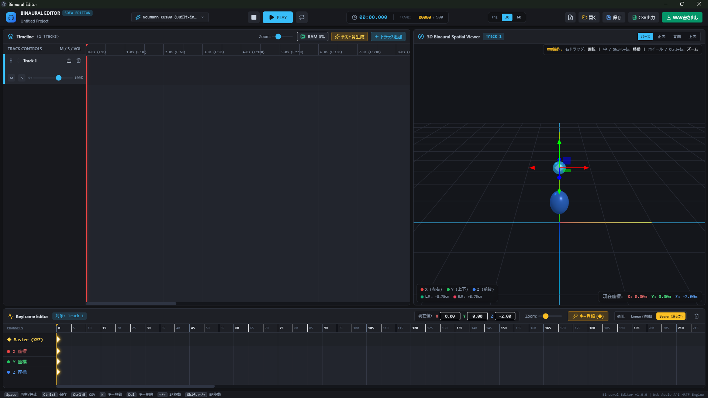

# Binaural Editor
直感的な操作で3Dバイノーラル（立体音響）音声編集ができるデスクトップアプリケーション


*(※ここにUIのスクリーンショット画像を配置)*

---

## ◆ 何ができるの？

1. **直感的な3D音源配置とキーフレーム補間**  
   マウスドラッグで音源を直感的に動かし、「どのタイミングで、どの位置（3D空間）に音源があるか」を自由に設定できます。  
   位置と時間を指定すれば、その間の動きは補間曲線（Bezier / Linear）で滑らかに自動補間されます。
2. **複数音声ファイルの配置・タイミング調整**  
   1つのトラック内に複数の音声ファイルを配置でき、それぞれの再生開始位置をタイムライン上で自由に調整可能です。
3. **マルチトラック対応 ＆ トラック並び替え**  
   トラックを追加して複数の音源を同時に鳴らすことができます。トラックはドラッグ＆ドロップまたは上下ボタンで直感的に並び替え可能です。
4. **SOFA形式のHRIR対応（高精度バイノーラル）**  
   SOFA形式のHRIRファイルを読み込み、リアルな立体音響をレンダリングできます（高品質な Neumann KU100 モデルを標準内蔵）。
5. **3D空間軌跡データのCSVエクスポート**  
   音源が移動した全フレームの3D座標データ（X, Y, Z）をCSV形式で書き出すことができ、外部ツールや分析との連携が可能です。

---

## ◆ 動作環境
- **OS**: Windows 10 (64bit) / Windows 11 (64bit)
- **CPU**: 4コア以上推奨
- **メモリ**: 8GB以上推奨（RAMプレビュー機能利用時）
- **GPU**: WebGL対応（3Dビューワ描画のため推奨）

---

## ◆ ダウンロード・起動方法

本アプリケーションは、インストール不要ですぐに使える**ポータブル版（ZIP）**を提供しています。また、開発者向けにソースコードから直接起動・ビルドする手順も記載しています。

### ● 一般利用（ポータブル版）
特別な開発環境（Node.js等）の導入は不要です。

1. **ダウンロード**  
   リポジトリ右側の **[Releases](../../releases/latest)** より、最新バージョンの `BinauralEditor-vX.X.X-win-portable.zip` をダウンロードします。
2. **解凍**  
   ダウンロードした ZIP ファイルを右クリックし、「すべて展開」を選択して任意のフォルダに解凍します。
3. **起動**  
   解凍されたフォルダ内の `BinauralEditor.exe` をダブルクリックすると起動します。

> **初回起動時に「WindowsによってPCが保護されました」と表示される場合**  
> 個人開発の未署名アプリのため、Windows Defender SmartScreen の警告が表示される場合があります。  
> 画面内の **「詳細情報」** をクリックし、右下に表示される **「実行」** ボタンを押してください。

**アンインストール方法**  
レジストリやシステム領域は使用していません。解凍したフォルダごと削除するだけで完了します。

### ● 開発者向け（ソースコードからの起動・ビルド）
- **前提条件**: Node.js (v18.0.0 以上推奨), npm / pnpm / yarn, Git

```bash
# 1. リポジトリのクローン
git clone https://github.com/Debucho/binaural-editor.git
cd binaural-editor

# 2. 依存関係のインストール
npm install

# 3. テストの実行
npm test

# 4. 開発モードでの起動（Vite + Electron）
npm run dev

# 5. 配布用パッケージ（EXE）のビルド
npm run build

```

---

## ◆ 使用方法

※操作の全体像は [紹介動画（準備中）](https://www.google.com/search?q=URL&utm_source=gemini) もあわせてご覧ください。

### 1. 画面左側：Timeline（タイムライン）

* **テスト音生成**: 画面上部の「テスト音生成」ボタンを押すと、手元に音声ファイルがなくてもすぐに立体音響の挙動をテストできます。
* **音声読み込み**: トラック名右側の「↑」ボタンを押し、音声ファイル（WAV / MP3等）を指定します。
* **音声削除**: トラック上の音声クリップにカーソルを合わせ、右上に表示されるゴミ箱ボタンを押します。
* **トラックの追加**: 「+ トラック追加」ボタンを押すと、新規トラックと対応する音源ボールが3Dビューワに追加されます。
* **トラックの並び替え**: トラックヘッダー左側のグリップアイコン（⋮⋮）をドラッグ＆ドロップするか、上下矢印（▲/▼）ボタンで順序を入れ替えることができます。
* **トラックの削除**: トラックのゴミ箱ボタンを押します。

### 2. 画面右側：3D Binaural Spatial Viewer（3Dビューワ）

MMD（MikuMikuDance）に準拠した視点操作に対応しています。

| 操作 | 動作 |
| --- | --- |
| **右ドラッグ** | 視点の回転（360度見回す） |
| **中クリック（ホイール押し込み）** または **Shift + 右ドラッグ** | 視点の平行移動（パン） |
| **マウスホイール** または **Ctrl + 右ドラッグ** | ズームイン / ズームアウト |
| **視点切り替えボタン** | 右上の「パース」「正面」「背面」「上面」で瞬時にカメラ位置を固定 |
| **左ドラッグ** | **音源ボールの移動**（選択した音源の位置を変更） |

※音源ボールを左ドラッグで移動させると、画面下部のキーフレームに現在座標が自動反映されます。

### 3. 画面下部：Keyframe Editor（キーフレームエディタ）

※操作したいトラックの音源ボールまたはタイムラインを選択してから操作してください。

* **キーフレーム登録**: タイムライン上で時間を指定し、「キー登録(◆)」ボタンを押すか、キーボードの `K` を押します。
* **キーフレーム削除**: 削除したいダイヤ（◆）をクリックし、ゴミ箱ボタンまたはキーボードの `Delete` を押します。
* **補間方式の切り替え**: 「補間: Linear (直線) / Bezier (滑らか)」ボタンで、移動の補間カーブを切り替えることができます。

### 4. 画面上部・全体操作

* **プロジェクト管理**: 画面右上のアイコンから「新規作成」「開く（プロジェクト読込）」「保存（`Ctrl + S`）」が行えます（`.bbproj` 形式）。
* **再生 / 停止**: 画面中央の再生/停止ボタン、または `Space` キーでプレビュー再生します。
* **WAV書き出し**: 画面右上の「WAV書き出し」を押すと、高音質なバイノーラル立体音響WAVファイルがレンダリング出力されます。
* **CSV出力 (`Ctrl + E`)**: 音源の3D移動軌跡（フレームごとのX/Y/Z座標データ）をCSVファイルとして保存できます。

---

## ◆ ショートカットキー一覧

| キー | 動作 |
| --- | --- |
| **Space** | 再生 / 一時停止 |
| **Ctrl + S** | プロジェクト保存（.bbproj） |
| **Ctrl + E** | 3D軌跡データのCSV出力 |
| **K** | 現在フレームにキーフレーム登録 |
| **Delete** | 選択中のキーフレーム削除 |
| **← / →** | 1フレーム前 / 次へ移動 |
| **Shift + ← / →** | 5フレーム前 / 次へ移動 |

---

## ◆ 利用規約・免責事項

### 利用規約

* **商用利用 / クリエイター奨励プログラム**: **OK**（本ツールを使用して制作された作品の収益化は自由です）
* **改変・再配布**: **OK**（ただし、悪意のある改変やマルウェア混入等の配布は禁止します）

### 免責事項

本ソフトウェアの使用、または使用不能によって生じたいかなるトラブル・損失・損害に対しても、作者は一切の責任を負いません。すべて自己責任においてご利用ください。

---

## ◆ コンテンツツリー（親作品）登録について

ニコニコ動画等で本ツールを使用した動画や音声作品を投稿された際は、ニコニ・コモンズの親作品として登録していただけると大変励みになります！

（※登録は任意です。登録していただければ喜んで作品を拝見しに行きます）

ニコニ・コモンズ作品ID: `ncXXXXXX` *(※登録後に記載)*

---

## ◆ 不具合報告・ご要望

不具合の報告や機能のご要望は、動画のコメント、X（旧Twitter）のDMまでお寄せください。

「こんな改造をした」「こんな使い方をした」といったご報告も大歓迎です！
